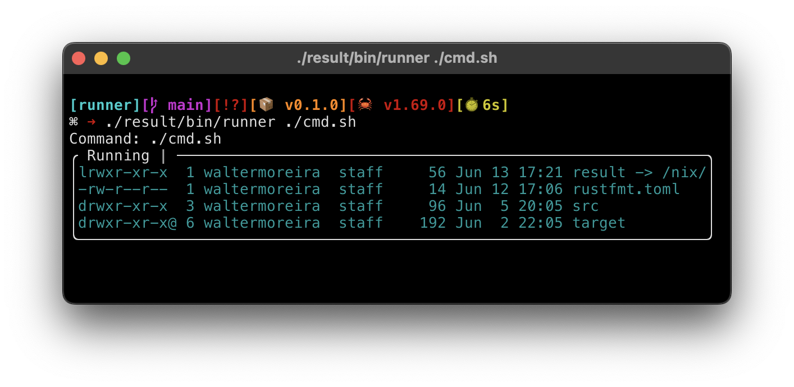

# Run commands with pretty-printed output

This is a simple runner that simple captures `stdout` and `stderr`, displays it in a contained box, and saves the streams for later access.

This is how it looks:

## Building

Using [Nix](https://nixos.org), run:
-  `nix build` to build the executable `./result/bin/runner`,
-  or `nix profile install` to install the command `runner` in your profiile.

## Developing

For hacking, run `nix develop` and use the provided Rust toolchain to compile.

## License

MIT